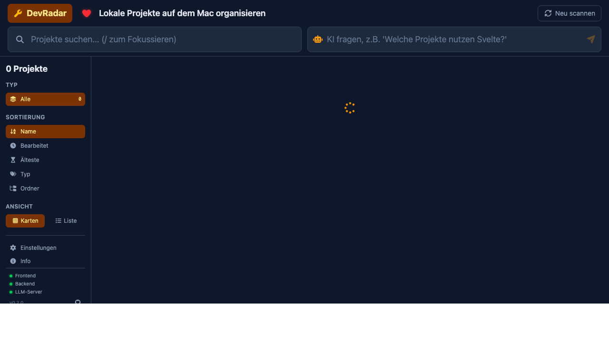

# DevRadar v0.2.0

Lokale Projekte auf dem Mac organisieren. DevRadar scannt konfigurierbare Verzeichnisse nach Softwareprojekten, indiziert sie und stellt ein Web-Dashboard bereit.



## Features

- **Projektscanner** -- Erkennt automatisch Git-Repositories, Node.js-, Python-, Docker- und Browser-Extension-Projekte
- **Volltextsuche** -- Schnelle FTS5-basierte Suche über Projektnamen, Beschreibungen, READMEs und Tags
- **KI-Integration** -- Optionale Anbindung an lokale LLMs für intelligente Projektsuche und automatische Beschreibungen
- **README-Viewer** -- Integrierte Anzeige mit Syntax-Highlighting, Zoom und Übersetzung ins Deutsche
- **Bild-Lightbox** -- Bilder in READMEs per Klick in Vollbildansicht, Navigation mit Pfeiltasten durch alle Bilder
- **YouTube-Erkennung** -- YouTube-Links werden als gecachte Thumbnails angezeigt, Video-ID kopierbar, Link kopierbar
- **Bild-Proxy** -- Alle externen Bilder (Badges, Screenshots) werden über das Backend gecacht ausgeliefert, keine direkten externen Aufrufe
- **README-Suche** -- Treffer-Navigation mit Hoch/Runter-Pfeilen, Enter springt zum nächsten Treffer
- **Mehrere Ansichten** -- Karten- und Listenansicht mit flexibler Filterung, Sortierung und Zebra-Striping
- **Dateisystem-Überwachung** -- Automatischer Rescan bei Änderungen in den Projektverzeichnissen
- **macOS-Integration** -- Projekte direkt im Finder, Terminal oder der IDE öffnen, Git-Repository im Browser öffnen
- **Erststart-Assistent** -- Führt beim ersten Start durch die Konfiguration der Scan-Verzeichnisse
- **History-Routing** -- Echte URL-Pfade (/project/42) statt Hash-Routing, Anker-Links scrollen inline
- **Pfeilnavigation** -- Projekte mit Pfeiltasten durchblättern, Position (z.B. "3 / 121") sichtbar

## Sicherheit

- **CSRF-Token** -- Alle schreibenden API-Requests erfordern einen Sitzungs-Token
- **CORS** -- Nur localhost auf konfiguriertem Port erlaubt
- **Path-Traversal-Schutz** -- Null-Byte-, Symlink- und Extension-Whitelist-Prüfung
- **DOMPurify** -- README-HTML wird sanitiert, iframes/script/style/Formulare blockiert
- **Bild-Proxy** -- Externe Bilder nur über Backend, nur erlaubte Content-Types
- **macOS TCC** -- Geschützte Systemordner werden beim Scan übersprungen
- **SQLite-Berechtigungen** -- Datenbankdatei mit chmod 0o600

## Installation

```bash
git clone https://github.com/HalloWelt42/macos-dev-organizer.git
cd macos-dev-organizer
./support/install.sh
```

Das Script erstellt eine Python-Umgebung, baut das Frontend und richtet einen macOS-LaunchAgent ein, der DevRadar automatisch startet.

Nach der Installation ist das Dashboard unter [http://localhost:10700](http://localhost:10700) erreichbar.

## Erststart

Beim ersten Start müssen Scan-Verzeichnisse konfiguriert werden. Das Dashboard zeigt einen Willkommens-Dialog, der durch die Einrichtung führt. Über die Einstellungen in der Sidebar können jederzeit weitere Verzeichnisse hinzugefügt oder entfernt werden. LLM-Server und Modell sind ebenfalls dort konfigurierbar.

## KI-Integration (optional)

DevRadar kann optional ein lokales LLM nutzen (z.B. über LM Studio). Die KI-Funktionen umfassen:

- Natürlichsprachliche Projektsuche ("Welche Projekte nutzen Svelte?")
- Automatische Projektbeschreibungen generieren
- README-Übersetzung ins Deutsche (Streaming, fachliche Begriffe bleiben erhalten)

Die KI-Einstellungen sind über die Sidebar konfigurierbar und standardmässig deaktiviert.

## Technologie

| Komponente | Technologie |
|---|---|
| Backend | Python, FastAPI, SQLite (FTS5), httpx |
| Frontend | Svelte 5, TypeScript, Tailwind CSS 4 |
| Icons | FontAwesome 7 (lokal, kein CDN) |
| Build | Vite |
| Markdown | marked.js, DOMPurify, highlight.js |
| Prozessmanagement | macOS LaunchAgent |

## Projektstruktur

```
devradar/          Python-Backend (FastAPI, Scanner, Datenbank, LLM, Bild-Proxy)
frontend/          Svelte 5 SPA (Dashboard, Detailansicht, Einstellungen)
support/           Installationsskripte und LaunchAgent-Template
docs/              Screenshots
```

## Lizenz

MIT
